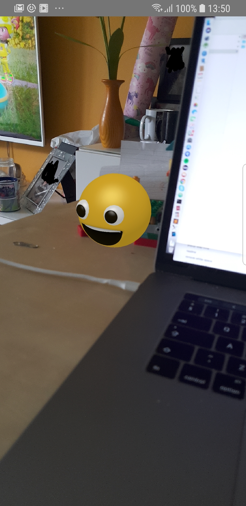

How I created the project!

react-viro init Strawberries --verbose 

Change API_KEY in App.js with a Viro Media API that you will obtain after Signing In

In the main folder run the sutup script ./setup-ide.sh

Go into the folder and run npm install

Open Android Studio and debug from the folder Strawberries/android

Run in the terminal react-native run-android --variant=gvrDebug

Follow instruction at https://blog.viromedia.com/how-to-build-an-interactive-ar-app-in-5-mins-w-react-native-viro-ar-e420147e1612 

Example

